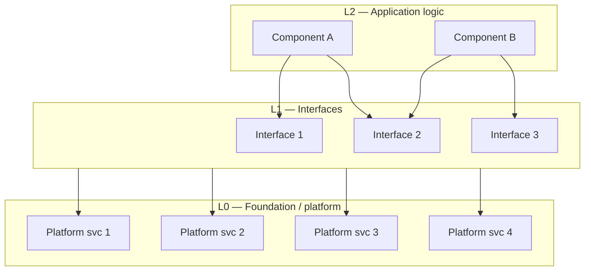

# Architecture Layering & Test Architecture

How to give an FSD a layered component architecture that the test strategy falls
out of. **Platform-independent** — the mechanism is the same for embedded, cloud,
mobile, SDR, or hybrid systems; only the layer *contents* and tier *names* change.
Two FSD homes:

- **§2.4 Component Layering** — the architecture (what the system is made of).
- **§8.0 Test Architecture** — the test tiers + a generated coverage matrix.

The seam: this skill (`fsd-writer`) *declares* the layers and an empty matrix
skeleton; a test-traceability tool *fills in* status. Structure vs. status.

---

## 1. Component layering

Decompose the system into a layered stack with a **strict one-way dependency** —
each layer may depend only on layers below it, never upward:

- **L0 — Foundation / platform.** Shared infrastructure the project *configures
  and uses* but does not implement or test as a project function. Library/SDK code
  and managed services pointed at the outside world.
- **L1 — Interfaces.** External-facing modules whose wire format / handler logic
  the project *owns*. Each talks to an external **black-box peer**.
- **L2 — Application logic.** The project's own decision functions. Consume L1
  output, decide what to do, drive interfaces. No wire-format parsing.

(Use more layers only if a system genuinely has them; three is the common case.)

### The L0-vs-L1 rule: ownership, not "is it shared"

The decisive question is **"did we implement and test the protocol/logic?"**

- A **library client or managed service pointed at the outside** (a broker client,
  an HTTP client over a stack, a managed DB/queue/auth provider) → **foundation
  (L0)**, even though it talks to the outside and is used by many callers. We own
  no protocol logic; the meaning of what flows lives in the layers above.
- A **module we hand-wrote** that owns a wire format or handler (a protocol
  decoder, a bus driver, an API request handler, an adapter) → **interface (L1)**.

"Used by many" does **not** make something foundation — shared services exist.
Foundation = shared infra we don't implement/test as a project function.

### Profiles (examples — pick what fits the system)

| Domain | L0 Foundation / platform | L1 Interfaces | L2 Application logic |
|---|---|---|---|
| Embedded / IoT | RF/network link, VPN, broker client, flash/NVS, RTOS | sensor decoders, bus drivers, device HTTP handlers, provisioning, OTA | control loops, state machines |
| Cloud / back-end | managed DB, queue, cache, auth provider, runtime | API/route handlers, external-service adapters | domain/business logic |
| Mobile / desktop | OS & UI SDK, storage, push/notification frameworks | data/network/device adapters | view-models, business logic |

Keep the ownership rule across all profiles.

---

## 2. The architecture diagram

Include a **layered stack diagram** in §2.4 — one box per layer, stacked
top-to-bottom (application on top, foundation at the bottom), each box listing its
components on one horizontal row.

### Mermaid convention (and the layout gotcha)



**Critical gotcha:** Mermaid **ignores a subgraph's `direction LR`** as soon as an
edge crosses that subgraph's boundary. So a subgraph→subgraph edge like `L1 --> L0`
makes L0 fall back to the parent `TB` and stack its nodes **vertically**. Do **not**
rely on `direction LR` to lay a layer out horizontally.

**Instead, fan the dependency edges onto each node of the lower layer**
(`L1 --> F1 & F2 & F3 & F4`). Making every node an edge *target* puts them on a
single rank → a horizontal row. This is the same mechanism that lays an upper
layer out horizontally when it receives edges from above.

**Verify by a rendered screenshot before claiming a layout works** — Mermaid
layout is not obvious from source.

### ASCII fallback

If Mermaid layout can't be verified or must render in plain viewers, a deterministic
ASCII band diagram is acceptable:

```
┌─ L2 · Application logic ──────────────────────────────────
│   Component A   ·   Component B
│                       ▼ depends on
├─ L1 · Interfaces ────────────────────────────────────────
│   Interface 1 · Interface 2 · Interface 3
│                       ▼ depends on
├─ L0 · Foundation / platform ─────────────────────────────
│   Platform svc 1 · 2 · 3 · 4
└───────────────────────────────────────────────────────────
```

---

## 3. Test tiers

Place each behaviour at the **lowest tier where the bug it catches can manifest**.
Tier is a property of the behaviour (fixed); maturity (is the test written yet) is
separate — "cheap tier first" is scheduling, not a claim the expensive tier is a
better version of the cheap one.

Tiers are **cost-ordered execution environments**; name them per platform:

| Generic tier | Embedded | Cloud / back-end | Mobile |
|---|---|---|---|
| Fast / isolated | host (dev machine) | unit | unit |
| Integrated | target (the device) | integration | instrumented device |
| Full-system | bench (device + real peers) | staging / e2e | e2e |
| Other | — non-runnable: 3rd-party/CI/review | — | — |

Mapping to layers (any profile):
- **L0 foundation** → exercised **transitively** (never in isolation; empty
  fast-tier cells are expected, not gaps).
- **L1 interfaces** → pure converter/policy core at the **fast/isolated** tier;
  wire/flow at the integrated/full-system tiers. Split the pure core out as a free
  function (e.g. a validation predicate separate from its I/O handler) so it is
  testable at the fast tier.
- **L2 application logic** → **fast/isolated** tier as pure functions.

---

## 4. Component × tier coverage matrix

§8.0 should reference a **generated** matrix: rows = the §2.4 components (grouped
by layer), columns = tiers, each cell = covered/total requirements at that
(component, tier). Generate it from traceability data (requirement → component;
requirement → tier) crossed with test linkage — so it cannot drift from the code.
Mark L0 fast-tier cells as expected-empty.

`fsd-writer` authors the architecture and the empty skeleton; the traceability
tool populates status. Do not hand-maintain the filled matrix in the FSD.
